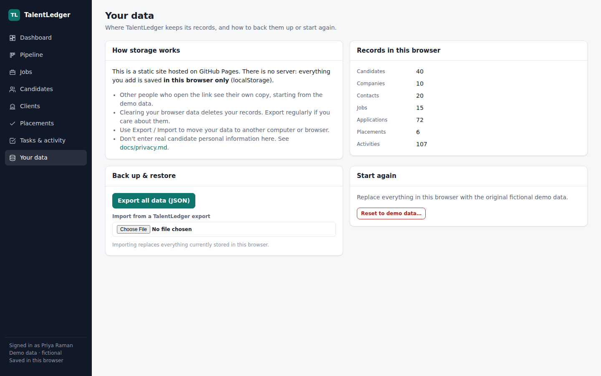

# TalentLedger: a CRM for recruitment agencies

**Live demo:** https://business-analyst-services.github.io/recruitment-crm/

TalentLedger is a lightweight CRM for a small-to-mid recruitment agency. It covers the whole desk:
**clients and contacts → jobs → candidate pipeline → placements and fees**, with activity logging and follow-up
tasks throughout. It's set up for an Australian agency: AUD, the July–June financial year, ABNs, perm fees as a
percentage of base, contractor pay/charge margin, and Australian Privacy Principles (APP) basics built in.


> **Demo notice:** this is a static site. It ships with fictional demo data, and anything you add is saved **only in your
> own browser** (localStorage). Other people who open the link get their own copy. Don't enter real candidate details.
> See [Your data](#your-data) below.

## What's inside

| Screen | What you can do |
|---|---|
| **Dashboard** | Open jobs, active candidates, interviews in the next 7 days, placements and fees this FY, fees still to invoice, priority jobs, pipeline funnel, tasks due, team activity |
| **Pipeline** | Kanban board across all open jobs (or per job): *Sourced → Screened → Submitted → Interview → Offer → Placed*, plus Rejected / Withdrawn. Drag and drop or use the stage menu. Days-in-stage flags cards that have gone stale |
| **Jobs** | Perm / contract / temp roles, contingent / exclusive / retained, salary band or day rate, fee %, priority, owner. Each job has its own board, a brief, and suggested candidate matches |
| **Candidates** | Talent pool with search and filters (status, perm/contract, owner), full profile, applications, activity history |
| **Clients** | Companies with status (prospect / active / dormant), signed terms flag, standard fee, contacts and hiring managers, jobs, lifetime fees |
| **Placements** | Perm placements (base × fee % = fee, invoice status, guarantee period) and contractors on assignment (pay rate, charge rate, margin) |
| **Tasks & activity** | Calls, emails, meetings, notes, interviews and tasks, linked to any mix of candidate, client and job |
| **Privacy** | Collection-notice / consent capture, *do not contact* status, per-candidate data export (APP 12), permanent erasure (APP 11.2) |
| **Your data** | Export everything to JSON, import it on another browser, or reset to the demo data |

Moving a candidate to **Placed** automatically creates a placement (fee pre-calculated from the job and candidate),
marks the candidate as placed, and logs it in the activity history. Moving them back out removes the provisional placement.

<details>
<summary>More screenshots</summary>

**Pipeline board**


**Job with its own board and brief**


**Candidate profile, applications, privacy controls**


**Placements: perm fees and contractor margin**


**Your data: export, import, reset**

</details>

## Files

| Path | Description |
|---|---|
| `index.html` | App shell and navigation |
| `assets/app.js` | Hash router, form handling, drag and drop |
| `assets/views.js` | Every screen (dashboard, pipeline, jobs, candidates, clients, placements, tasks, data) |
| `assets/store.js` | Data model, business rules (stage moves, placement fees, erasure) and the demo data |
| `assets/ui.js` | Formatting (AUD, dates) and HTML helpers |
| `assets/styles.css` | Styles, with light and dark themes |
| `docs/` | Domain model, recruitment process, privacy notes, roadmap |

No frameworks, no build step: plain HTML, CSS and JavaScript modules, the same as the other Business Analyst Services demo sites.

## Running locally

It's a fully static site, but it uses JavaScript modules, so open it through a local web server rather than by double-clicking `index.html`:

```bash
# any static server works, e.g.
python3 -m http.server 8000
# then open http://localhost:8000
```

## Deploying with GitHub Pages

Settings → Pages → Deploy from a branch → `main` / `(root)`. The site is served at
`https://<owner>.github.io/recruitment-crm/`. The empty `.nojekyll` file tells Pages to serve the files as-is.

## Your data

- Everything is stored in the browser's `localStorage` under the key `talentledger:v1`. Nothing is sent to a server.
- Each browser and device has its own copy. Clearing site data deletes it.
- **Your data** in the sidebar lets you export a JSON backup, import it elsewhere, or reset to the demo data.
- For a team to share one live database you need a backend. See [docs/roadmap.md](docs/roadmap.md).

## Documentation

- [Domain model](docs/domain-model.md): entities, relationships and key rules (with ER diagram)
- [Recruitment process](docs/process.md): the agency workflow the CRM supports, stage by stage
- [Privacy](docs/privacy.md): how the build maps to the Australian Privacy Principles, and the gaps
- [Roadmap](docs/roadmap.md): what to build next, in priority order
