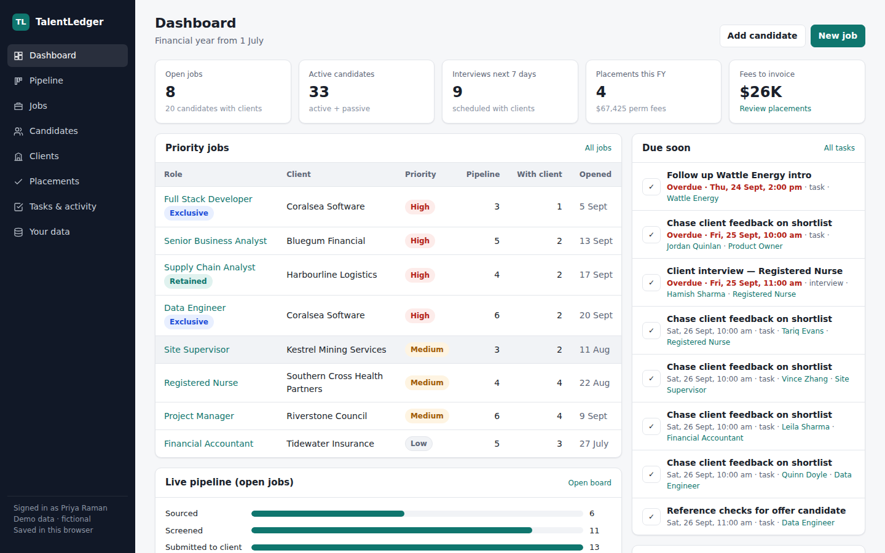
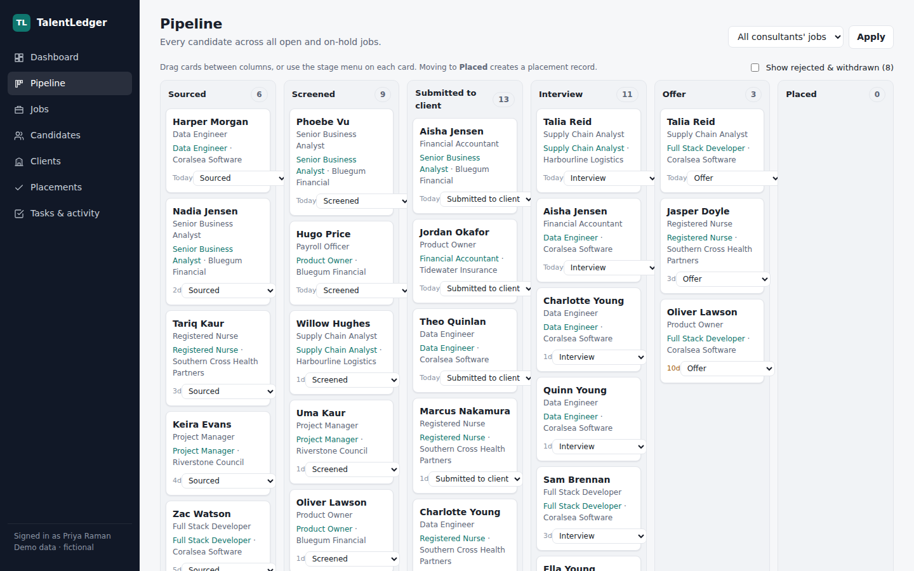
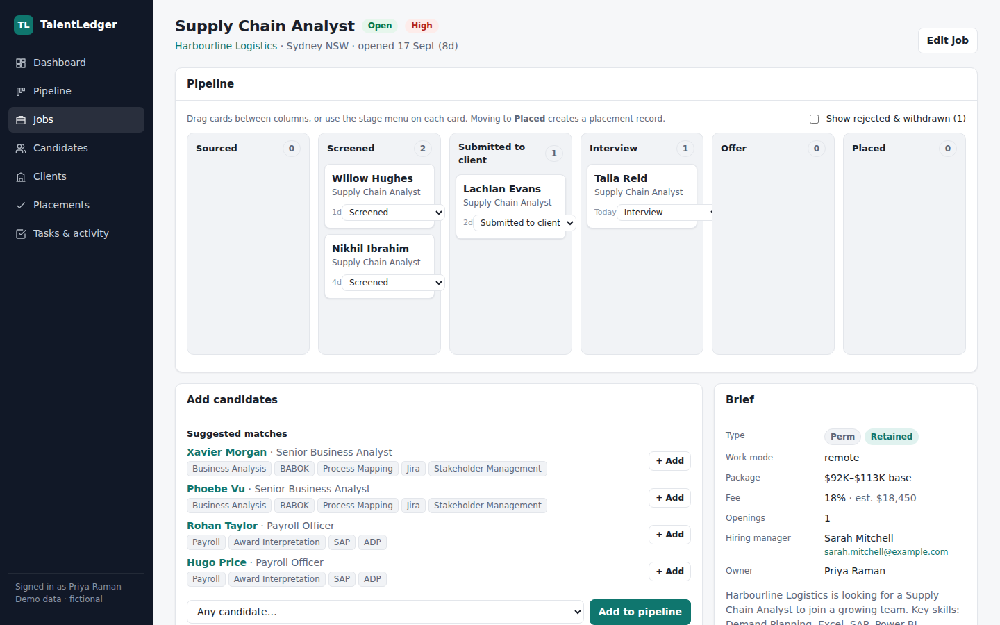
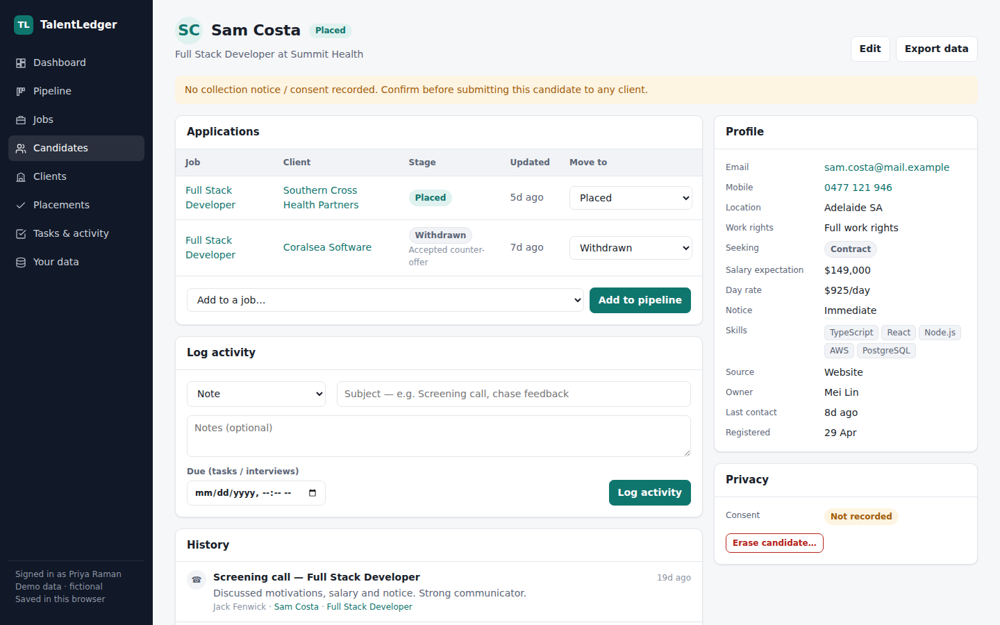
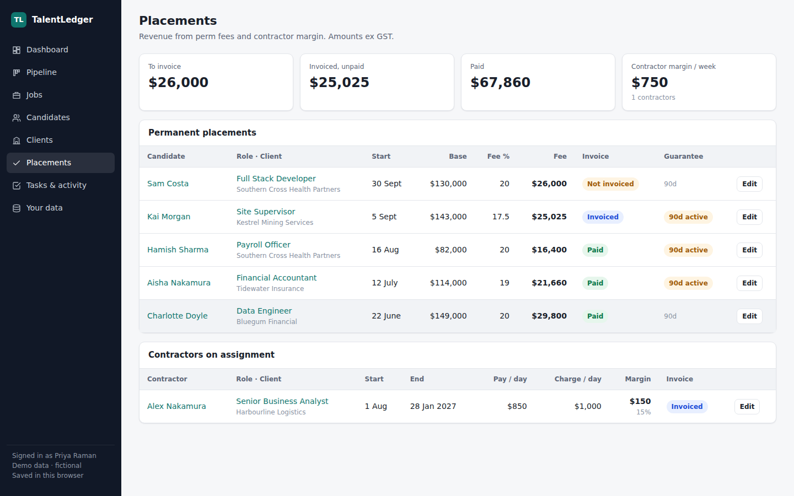

# TalentLedger — a CRM for recruitment agencies

TalentLedger is a lightweight, self-hosted CRM for a small-to-mid recruitment agency. It covers the whole desk:
**clients and contacts → jobs → candidate pipeline → placements and fees**, with activity logging and follow-up
tasks throughout. It's set up for an Australian agency: AUD, the July–June financial year, ABNs, perm fees as a
percentage of base, contractor pay/charge margin, and Australian Privacy Principles (APP) basics built in.

> **Status:** working MVP / reference implementation. It ships with fictional demo data and has no login yet.
> See [docs/roadmap.md](docs/roadmap.md) for what's needed before real candidate data goes in.



## What's in it

| Area | What you can do |
|---|---|
| **Dashboard** | Open jobs, active candidates, interviews in the next 7 days, placements and fees this FY, fees still to invoice, priority jobs, pipeline funnel, tasks due, team activity |
| **Pipeline** | Kanban board across all open jobs (or per job): *Sourced → Screened → Submitted → Interview → Offer → Placed*, plus Rejected / Withdrawn. Drag and drop or use the stage menu. Days-in-stage flags cards that have gone stale |
| **Jobs** | Perm / contract / temp roles, contingent / exclusive / retained, salary band or day rate, fee %, priority, owner. Each job has its own board, a brief, and suggested candidate matches |
| **Candidates** | Talent pool with search and filters (status, perm/contract, owner), full profile, applications, activity history |
| **Clients** | Companies with status (prospect / active / dormant), signed terms flag, standard fee, contacts and hiring managers, jobs, lifetime fees |
| **Placements** | Perm placements (base × fee % = fee, invoice status, guarantee period) and contractors on assignment (pay rate, charge rate, margin) |
| **Tasks & activity** | Calls, emails, meetings, notes, interviews and tasks, linked to any mix of candidate, client and job |
| **Privacy** | Collection-notice / consent capture, *do not contact* status, one-click data export for access requests (APP 12), permanent erasure (APP 11.2) |

Moving a candidate to **Placed** automatically creates a placement (fee pre-calculated from the job and candidate),
marks the candidate as placed, and logs it in the activity history. Moving them back out removes the provisional placement.

<details>
<summary>More screenshots</summary>

**Pipeline board**


**Job with its own board and brief**


**Candidate profile, applications, privacy controls**


**Placements: perm fees and contractor margin**

</details>

## Quick start

Requires **Node.js 22.13 or later** (the app uses Node's built-in SQLite, so there's no database to install).

```bash
npm install
npm run dev          # seeds demo data on first run, then starts http://localhost:3000
```

Other scripts:

```bash
npm run reset        # delete the database and reseed the demo data
npm run build && npm start   # production build
npm run typecheck
```

The database lives at `data/talentledger.db` (git-ignored). Set `DATABASE_PATH` to put it somewhere else, and
`APP_TIMEZONE` to change the display time zone (default `Australia/Sydney`). See `.env.example`.

> Node prints an `ExperimentalWarning` for SQLite on startup. It's harmless.

## Tech

- **Next.js 15** (App Router, React Server Components, Server Actions) + TypeScript
- **SQLite** via `node:sqlite` — one file, zero config; schema in [`lib/schema.sql`](lib/schema.sql)
- Plain CSS with light/dark themes — no UI framework
- No external services

```
app/                 Pages (dashboard, pipeline, jobs, candidates, clients, placements, activities)
app/api/             Candidate data export endpoint
components/          Kanban board, forms, activity feed, UI primitives
lib/schema.sql       Database schema
lib/db.ts            SQLite connection + query helpers
lib/actions.ts       All writes (Server Actions): create/update records, stage moves, placements
lib/queries.ts       Shared reads
scripts/seed.mjs     Demo data (fictional companies and people)
docs/                Domain model, recruitment process, privacy notes, roadmap
```

## Documentation

- [Domain model](docs/domain-model.md) — entities, relationships and key rules (with ER diagram)
- [Recruitment process](docs/process.md) — the agency workflow the CRM supports, stage by stage
- [Privacy](docs/privacy.md) — how the build maps to the Australian Privacy Principles, and the gaps
- [Roadmap](docs/roadmap.md) — what to build next, in priority order
