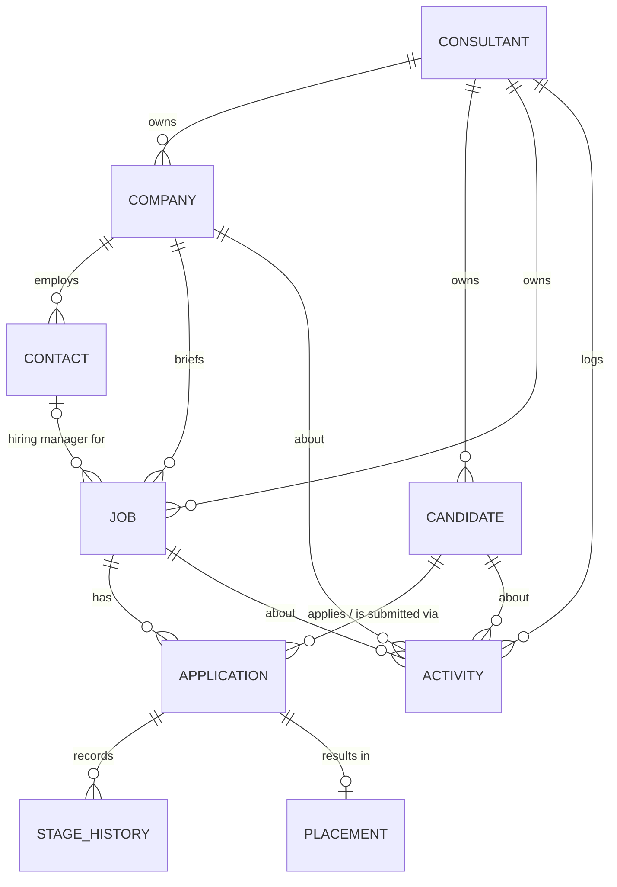

# Domain model

A recruitment agency works two markets at once: **clients** (who pay) and **candidates** (who are the product,
but also people with rights and preferences). The CRM joins those two sides through the **job** and the
**application**, the record of one candidate being considered for one job.

## Entities

| Entity | What it is | Key fields |
|---|---|---|
| **Consultant** | A user of the system: recruiter, resourcer, manager | name, email, role |
| **Company** (client) | An organisation you recruit for, or want to | status (prospect / active / dormant), ABN, signed terms, standard fee % |
| **Contact** | A person at a client | title, email, phone, hiring-manager flag |
| **Candidate** | A person in your talent pool | current role, skills, perm/contract, salary expectation or day rate, notice, work rights, source, status, consent |
| **Job** | A vacancy you've been briefed on | type (perm / contract / temp), engagement (contingent / exclusive / retained), salary band or charge rate, fee %, priority, status |
| **Application** | One candidate in one job's pipeline | stage, rejection/withdrawal reason, timestamps |
| **Stage history** | Every stage change on an application | from, to, when. Powers time-in-stage and conversion reporting |
| **Placement** | A successful outcome | perm: start date, base, fee %, fee, guarantee days. Contract: pay rate, charge rate, end date. Invoice status |
| **Activity** | Anything that happened or needs to happen | kind (note / call / email / meeting / interview / task), subject, body, due date, done date. Links to any of candidate, company, contact, job |

## Rules the app enforces

1. **A candidate can only be in a job's pipeline once** (`UNIQUE(candidate_id, job_id)`).
2. **Every stage move is recorded** in `stage_history`, so reporting can look back at how a pipeline moved.
3. **Placed creates a placement.** For perm, the fee is `base × fee %`. Base defaults to the candidate's expectation,
   otherwise the midpoint of the job's band. For contract, pay and charge rates come from the candidate and job.
   Both are editable on the Placements page.
4. **The job's fee defaults to the client's standard fee** when left blank.
5. **Do-not-contact candidates and candidates without recorded consent** are left out of "add to pipeline" pickers.
6. **Erasing a candidate cascades.** Applications, placements, stage history and activities about them are deleted.
7. **Logging a call, email or meeting against a candidate updates their "last contacted" date.**

## Pipeline stages

| Stage | Meaning | Typical exit criteria |
|---|---|---|
| Sourced | Identified as a possible fit | Contacted and interested |
| Screened | Consultant has interviewed and qualified them | Candidate agrees to be submitted (right to represent) |
| Submitted | CV sent to the client | Client requests interview, or declines |
| Interview | One or more client interviews | Offer, or rejection |
| Offer | Verbal or written offer out | Accepted → Placed, or declined |
| Placed | Accepted, start date set | Guarantee period passes |
| Rejected | Client or agency said no | Reason recorded |
| Withdrawn | Candidate pulled out | Reason recorded (counter-offer, other role…) |

## Money

- All amounts are **AUD, ex GST**.
- **Perm fee** = first-year base × fee %. Typical market range is 15–25%. Retained searches are often billed in stages
  (engagement, shortlist, placement). That isn't modelled yet; see the roadmap.
- **Contract margin** = charge rate − pay rate, per day. The placements page shows weekly margin as 5 × daily.
  Payroll tax, super and workers' comp on-costs are not modelled yet.
- **Guarantee period** (default 90 days) is the rebate/replacement window if a perm placement leaves early.
