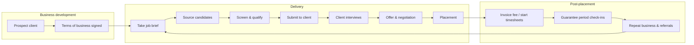

# Recruitment process

The end-to-end agency workflow and where each step lives in TalentLedger.

| # | Step | Who | In the CRM |
|---|---|---|---|
| 1 | **Prospect** a company: calls, meetings, proposals | Consultant / BDM | Client with status *Prospect*, activities and tasks against it |
| 2 | **Sign terms of business**: fee %, guarantee, payment terms | Consultant | *Signed terms* flag, standard fee %. Banner warns until terms are signed |
| 3 | **Take the brief** from the hiring manager | Consultant | New job: type, engagement, band or rate, fee, priority, hiring manager, brief |
| 4 | **Source** from the database, job boards, LinkedIn, referrals | Resourcer | Suggested matches on the job page; add to pipeline at *Sourced* |
| 5 | **Screen**: motivations, salary, notice, work rights, right to represent | Consultant | Log a screening call; move to *Screened*. Consent must be recorded |
| 6 | **Submit** the shortlist to the client | Consultant | Move to *Submitted*; add a task to chase feedback |
| 7 | **Interviews**: schedule, prep and debrief both sides | Consultant | Log an *Interview* activity with a due date (shows on the dashboard); move to *Interview* |
| 8 | **Offer**: negotiate, manage counter-offers, reference checks | Consultant | Move to *Offer*; tasks for references |
| 9 | **Place** | Consultant | Move to *Placed*: placement created with fee, candidate marked placed |
| 10 | **Invoice** (perm) or **start timesheets** (contract) | Finance | Placements page: invoice status, rates, margin |
| 11 | **Guarantee** check-ins at 1 week, 1 month and 3 months | Consultant | Guarantee badge while active; tasks for check-ins |
| 12 | **Close the job** and nurture | Consultant | Job status *Filled*; client status stays *Active* |

## Metrics this supports (and the ones on the roadmap)

Live now: open jobs, active candidates, interviews next 7 days, placements and perm fees this FY, fees to invoice,
funnel by stage, days in stage, job age.

From `stage_history` (roadmap): submission-to-interview ratio, interview-to-offer ratio, time-to-fill,
time-to-submit, consultant leaderboards and fall-off reasons.
